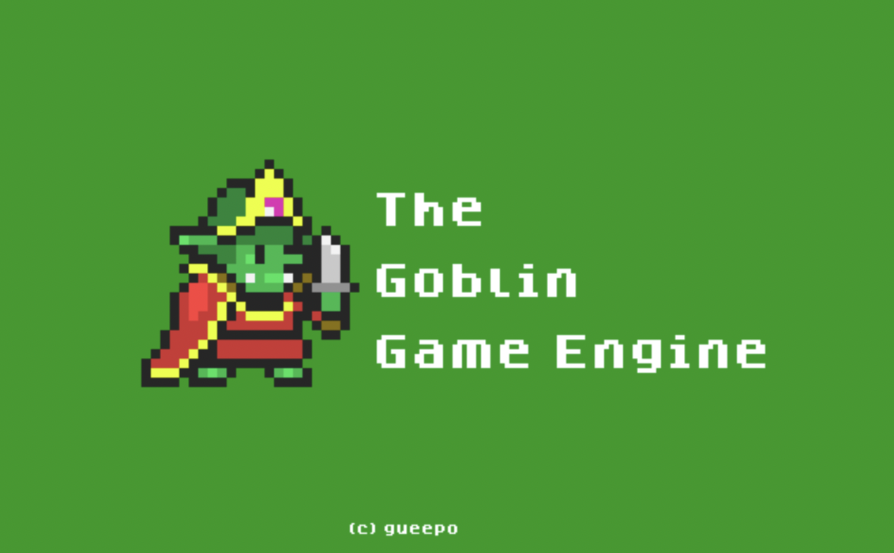
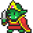

# Goblin Game Engine 


1. built with gueepo2D
2. Resource Manager
3. ECS
4. LUA
5. Editor
   1. The editor should be able to create/edit/save/load maps, and tilemaps
   2. The editor should be able to create/edit/save/load entities
   3. The editor should be able to create/edit/save/load scenes
   4. The editor should be able to create/edit/save/load resources

The end goal is to be able to create an entire game without coding C++, but if I can and think it's a good idea to do C++ while making a game with The Goblin Game Engine, then cool.

---

### Emscripten

Important notes on how to build with Emscripten.

First, configure the CMake project with something like this.

```
cmake -DCMAKE_EXPORT_COMPILE_COMMANDS:BOOL=TRUE -DCMAKE_BUILD_TYPE:STRING=Debug -G "Unix Makefiles" -DCMAKE_TOOLCHAIN_FILE=/opt/homebrew/Cellar/emscripten/3.1.32/libexec/cmake/Modules/Platform/Emscripten.cmake -S/Users/gdeoliveira/workspace/goblin -B/Users/gdeoliveira/workspace/goblin/www
```

Second, move into the www (`cd www`) folder, and `make all`

The output can only be run on a web server, or `emrun goblin-engine.html`